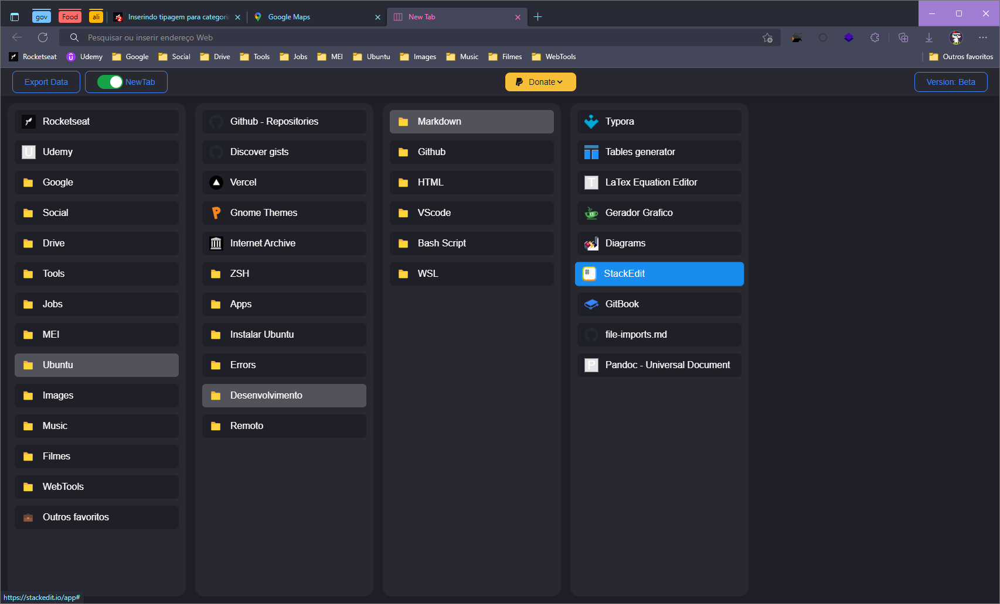

#  Bookmarks Column View

This project was build for learning propose. See the demo by clicking on the image above.

  

### Technologies

- React
- Typescript
- Redux
- Tailwind
- Framer Motion
- Chrome Extension

## Inspirations

Code Inspire: 
- [Another Tab](https://chrome.google.com/webstore/detail/another-tab/oaaeanlgefipegfcbgpgnhhnpengdjld)
-  [AnotherTab - New Tab page](https://chrome.google.com/webstore/detail/anothertab-new-tab-page/cpeojfdfhhgedcaiglbjdklaigennhpl)

Visual Inspire:  
- [Qlearly Light - Bookmark Manager](https://chrome.google.com/webstore/detail/qlearly-light-bookmark-ma/lkmkjmklcnhfcfpojimnbjpaimbdjeao)

### Next features

- [ ] Dark/light mode
- [ ] Search bookmark
- [ ] Edit order of bookmarks

### Developing locally

This is a standard Create React App, so you can easily start working on it by simply cloning the project and running `yarn` to install all its dependencies.

To develop the app locally you can run `yarn start`, I already included some fake bookmarks to simulate the production behavior of the extension.

Open [http://localhost:3000](http://localhost:3000) to view it in the browser.

### Build for Production

Builds the app for production with the command `yarn build` to the *build* folder.
It correctly bundles React in production mode and optimizes the build for the best performance.

To publish the extension is necessary configure a "*public/manifest.json*" file. To Learn more i recommended read the following page [Creating a Chrome extension with React and TypeScript](https://blog.logrocket.com/creating-chrome-extension-react-typescript/).

